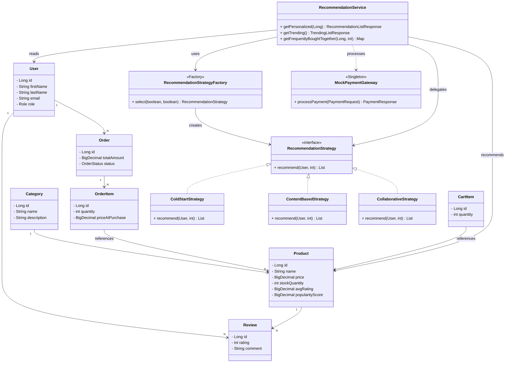

# Final Design Patterns Project Report

## 1. Final Project Title

**RECO — Intelligent E-Commerce Platform with Recommendation Engine**

---

## 2. Final Project Description

RECO is a full-stack intelligent e-commerce platform designed to simulate a real-world online shopping experience with a built-in recommendation engine. The system addresses the problem of product overload in modern e-commerce platforms by providing users with personalized product suggestions based on their behavior and preferences, while also offering a complete end-to-end shopping flow including user authentication, product catalog browsing, cart management, order processing, and a mock payment system.

**Target users:** Online shoppers and e-commerce administrators.

---

## 3. Requirements Summary

### Functional Requirements
- FR-1: User registration, login, role-based access (ADMIN/CUSTOMER)
- FR-2: Product catalog CRUD with search, pagination, and sort
- FR-3: Shopping cart management (add, update, remove, clear)
- FR-4: Order placement and status management
- FR-5: Mock payment processing
- FR-6: Product reviews with ratings, pagination, and distribution stats
- FR-7: Recommendation engine with personalized, trending, and FBT
- FR-8: Admin dashboard with user/product/order management

### Non-Functional Requirements
- NFR-1: JWT-based authentication and authorization
- NFR-2: Database-backed cart and orders (PostgreSQL)
- NFR-3: Layered architecture (Controller → Service → Repository)
- NFR-4: RESTful API design with CORS support
- NFR-5: Recommendation caching with 1-hour TTL

---

## 4. Final System Architecture

The system follows a 3-tier architecture:

```
Frontend (SPA)  ─── REST API (JSON/CORS) ─── Backend (Spring Boot) ─── Database (PostgreSQL)
```

The backend is organized in layers:
- **Controller Layer** — REST endpoints, request validation, response formatting
- **Service Layer** — Business logic, recommendation strategies, payment processing
- **Repository Layer** — Database operations via Spring Data JPA

**Key Modules:**
- User & Security (JWT, Role-based access)
- Catalog & Inventory (Products, Categories)
- Order & Payment (Mock Payment Gateway)
- Recommendation Engine (Strategy + Factory patterns)

The full architecture diagram is available in `Architecture.png` and `REQUIREMENTS_AND_DESIGN.md` (Section: High-Level Architecture). Both remain accurate for the final implementation.

### Deployment Architecture
- **Frontend:** Static files served via Vite dev server or any HTTP server
- **Backend:** Spring Boot 4.0.6 running on localhost:8080
- **Database:** PostgreSQL 18.3 running locally
- **Communication:** REST over HTTP, stateless JWT authentication

---

## 5. Final Class Diagram

The UML class diagram below shows the main classes, attributes, methods, and relationships. Design pattern implementations are highlighted with `<<stereotypes>>`.



### Design Pattern Mapping

| Pattern | Classes | How It Works |
|---|---|---|
| **Strategy** | `RecommendationStrategy` ← `ColdStartStrategy`, `ContentBasedStrategy`, `CollaborativeStrategy` | Three interchangeable algorithms selected at runtime based on user signals |
| **Factory** (Simple) | `RecommendationStrategyFactory` → creates `RecommendationStrategy` | Encapsulates selection logic: checks user's reviews/interactions and picks the right strategy |
| **Builder** | `@Builder` on: `Product`, `Order`, `ProductResponse`, `AuthResponse`, `ReviewResponse`, `RecommendationItemResponse`, `FrequentlyBoughtTogetherResponse` | Lombok-generated fluent constructors for entities and DTOs with many fields |
| **Singleton** | `MockPaymentGateway`, all `@Service` / `@Component` beans | Spring-managed single instances — consistent state, thread-safe |

---

## 6. Applied Design Patterns

### DP-1: Strategy Pattern
| Field | Description |
|---|---|
| **Category** | Behavioral |
| **Where used** | Recommendation engine — three interchangeable algorithms |
| **Why suitable** | Users need different recommendation logic based on their signal level (new user vs active user) |
| **Classes involved** | `RecommendationStrategy` (interface), `ColdStartStrategy`, `ContentBasedStrategy`, `CollaborativeStrategy` |
| **Benefit** | Strategies are interchangeable at runtime; new strategies can be added without modifying existing code (Open/Closed Principle) |

### DP-2: Factory (Simple Factory) Pattern
| Field | Description |
|---|---|
| **Category** | Creational |
| **Where used** | `RecommendationStrategyFactory` selects the correct strategy based on user signals |
| **Why suitable** | The selection logic depends on runtime data (has reviews? has interactions?) and shouldn't be scattered across the service layer |
| **Classes involved** | `RecommendationStrategyFactory`, `RecommendationStrategy` (interface and implementations) |
| **Benefit** | Centralizes object creation logic; encapsulates strategy selection from the caller |

### DP-3: Builder Pattern
| Field | Description |
|---|---|
| **Category** | Creational |
| **Where used** | DTOs and entities throughout the project via Lombok `@Builder` annotation |
| **Why suitable** | Many DTOs have multiple fields (some required, some optional). Builder provides a fluent and readable construction API |
| **Classes involved** | All `@Builder`-annotated classes: `ProductResponse`, `AuthResponse`, `OrderResponse`, `RecommendationItemResponse`, `FrequentlyBoughtTogetherResponse`, etc. |
| **Benefit** | Improves code readability; eliminates telescoping constructors; compile-time safety |

### DP-4: Singleton Pattern (implicit via Spring)
| Field | Description |
|---|---|
| **Category** | Creational |
| **Where used** | All `@Service`, `@Component`, and `@Repository` beans including `MockPaymentGateway` |
| **Why suitable** | Services should have a single shared instance for consistent state and resource efficiency |
| **Classes involved** | All Spring-managed beans (implicit) |
| **Benefit** | Managed by Spring IoC container; thread-safe; single point of access |

---

## 7. Implementation / Prototype

### Implemented Features
- ✅ User registration, login, JWT authentication with role-based access (ADMIN/CUSTOMER)
- ✅ Product CRUD with search (`ILIKE`), pagination, sorting (by name, price, popularity, rating, date)
- ✅ Product images: single main image + gallery (jsonb)
- ✅ Category CRUD
- ✅ Cart management (add, update quantity, remove, clear)
- ✅ Order placement (cart → order with stock validation)
- ✅ Mock payment processing (`MockPaymentGateway`)
- ✅ Review system with pagination, sorting, and rating distribution (1–5 star breakdown)
- ✅ **Recommendation engine:**
  - Trending/popular (top 10 by popularity score)
  - Personalized (Strategy pattern with ColdStart, ContentBased, Collaborative)
  - Frequently Bought Together (live co-purchase analysis via SQL self-join)
  - Caching with 1-hour TTL and admin cache management
  - Interaction tracking (clicks, cart-adds)
- ✅ Admin endpoints (user list, product management, cache management)

### Database Tables
`users`, `products`, `categories`, `carts`, `cart_items`, `orders`, `order_items`, `payments`, `reviews`, `product_similarity`, `user_interactions`, `recommendation_cache`

### Incomplete Parts
- No real payment integration (mock only)
- Product similarity data must be pre-seeded — no batch job to auto-compute it
- No email notifications or async workflows

### Screenshots
Screenshots of the running system are available in `assets/Screenshots/`.

---

## 8. GitHub Repository Link

[GitHub Repository Link](https://github.com/AhmedLouay-coder21/Reco)

---

## 9. Testing Summary

| Test Case | Expected Result | Actual Result | Status |
|---|---|---|---|
| Register new user | 201 Created with JWT | 201 Created with JWT | ✅ Pass |
| Login with valid credentials | 200 OK with JWT | 200 OK with JWT | ✅ Pass |
| Login with invalid password | 401 Unauthorized | 401 Unauthorized | ✅ Pass |
| List products (public) | 200 OK with paginated list | 200 OK with paginated list | ✅ Pass |
| Search products by keyword | Filtered results matching keyword | Filtered results matching keyword | ✅ Pass |
| Create product (ADMIN) | 201 Created | 201 Created | ✅ Pass |
| Create product (CUSTOMER) | 403 Forbidden | 403 Forbidden | ✅ Pass |
| Add item to cart | 201 Created with updated cart | 201 Created with updated cart | ✅ Pass |
| Place order | 201 Created, stock deducted | 201 Created, stock deducted | ✅ Pass |
| Process payment | 201 Created SUCCESS | 201 Created SUCCESS | ✅ Pass |
| Create review | 201 Created | 201 Created | ✅ Pass |
| Get rating distribution | Correct 1-5 star counts | Correct 1-5 star counts | ✅ Pass |
| Get personalized recommendations | Returns products (or ColdStart fallback) | Returns products (or ColdStart fallback) | ✅ Pass |
| Get FBT for a product | Returns co-purchased products (or empty) | Returns co-purchased products (or empty) | ✅ Pass |
| Access admin endpoint (CUSTOMER) | 403 Forbidden | 403 Forbidden | ✅ Pass |
| Invalid JWT on public endpoint | 200 OK (public, no auth needed) | 200 OK | ✅ Pass |

---

## 10. Challenges and Lessons Learned

### Challenges
1. **Hibernate `bytea` binding bug** — Spring Boot 4.0.6 + PostgreSQL 18.3 binds String params as `VARBINARY` in JPQL. Solved by using native queries with `CAST(:q AS text)` + `ILIKE`.
2. **JWT filter causing 403 on public endpoints** — Invalid/expired JWTs from the frontend were being rejected at the filter level even for public endpoints. Fixed by widening exception handling in `JwtAuthenticationFilter`.
3. **Read-only transaction on write operation** — `getPersonalized()` was annotated `@Transactional(readOnly = true)` but writes cache entries, causing `ERROR: cannot execute INSERT in a read-only transaction`.
4. **Cold-start gap in merge path** — When both ContentBased and Collaborative strategies returned empty results (e.g., no similarity data, no overlapping users), the merge path had no fallback. Added an explicit ColdStart fallback.
5. **Double stock deduction** — Order placement was deducting stock in two places. Removed the duplicate.

### Lessons Learned
- Native queries are sometimes necessary despite JPA's abstraction
- Always verify `@Transactional` flags match actual operations (read vs write)
- Fallback chains are essential for recommendation systems — no data ≠ no result
- Strategy + Factory patterns make complex conditional logic testable and extensible
- Real purchase data is the best signal for recommendations (FBT approach)

---

## 11. Team Contribution

| Member | Contribution |
|---|---|
| **Abdelrahman Hany Farouk (SE1)** | [To be filled] |
| **Ahmad Louay Mahmoud (SE1)** | [To be filled] |
| **Youssef Waleed (SE1)** | [To be filled] |
| **Youssef Khaled (SE1)** | [To be filled] |
