# RECO API - Complete Endpoint List

## 1. AUTHENTICATION ENDPOINTS (5 endpoints) (JWT-Based)

POST /api/v1/auth/register
• Create account and automatically login with JWT tokens
• Input: username (string, unique), email (string, unique), password (string, min 8 chars), role (string, optional, default: CUSTOMER)
• Action: Hash password, create USER record, generate access_token + refresh_token
• Returns: {access_token (JWT), refresh_token (JWT), token_type: "Bearer", expires_in: 86400, user: {id, username, email, role, created_at}}
• Status: 201 Created
• Error: 400 Bad Request (validation), 409 Conflict (email exists)

POST /api/v1/auth/login
• Authenticate existing user and return JWT tokens
• Input: email (string), password (string)
• Action: Find user by email, verify password, generate access_token + refresh_token
• Returns: {access_token (JWT), refresh_token (JWT), token_type: "Bearer", expires_in: 86400, user: {id, username, email, role}}
• Status: 200 OK
• Error: 401 Unauthorized (invalid credentials), 404 Not Found (user not found)

GET /api/v1/auth/me
• Get current authenticated user details
• Authorization: Required (Bearer token in header)
• Action: Extract user_id from JWT, fetch user record
• Returns: {id, username, email, role, created_at}
• Status: 200 OK
• Error: 401 Unauthorized (missing/invalid token)

POST /api/v1/auth/refresh
• Get new access token using refresh token (extends session)
• Input: refresh_token (JWT string)
• Action: Verify refresh_token, generate new access_token
• Returns: {access_token (JWT), token_type: "Bearer", expires_in: 86400}
• Status: 200 OK
• Error: 401 Unauthorized (invalid/expired token)

POST /api/v1/auth/logout
• Invalidate user session and blacklist token
• Authorization: Required (Bearer token in header)
• Action: Add token to blacklist (database or Redis)
• Returns: {success: true, message: "Logged out successfully"}
• Status: 200 OK
• Error: 401 Unauthorized (missing/invalid token)

---

## 2. USER ENDPOINTS (4 endpoints)

GET /api/v1/users/{id}
• Get user details
• Authorization: Required (Bearer token)
• Returns: {id, username, email, role, created_at}

PUT /api/v1/users/{id}
• Update user (own data only or ADMIN)
• Authorization: Required (Bearer token)
• Input: username, email, role
• Returns: updated user

DELETE /api/v1/users/{id}
• Delete user (cascades to orders, carts, interactions, cache)
• Authorization: Required (Bearer token)
• Returns: {success: true, message: "User deleted"}

GET /api/v1/users (ADMIN ONLY)
• List all users
• Authorization: Required (Bearer token + ADMIN role)
• Query params: page, limit
• Returns: {total, page, limit, users: [{id, username, email, role, created_at}]}

---

## 3. CATEGORY ENDPOINTS (5 endpoints)

GET /api/v1/categories
• List all categories
• Returns: {total, categories: [{id, name, description}]}

GET /api/v1/categories/{id}
• Get category details
• Returns: {id, name, description}

POST /api/v1/categories (ADMIN ONLY)
• Create category
• Input: name, description
• Returns: {id, name, description, created_at}

PUT /api/v1/categories/{id} (ADMIN ONLY)
• Update category
• Input: name, description
• Returns: updated category

DELETE /api/v1/categories/{id} (ADMIN ONLY)
• Delete category
• Returns: {success: true, message: "Category deleted"}

---

## 4. PRODUCT ENDPOINTS (6 endpoints)

GET /api/v1/products
• List all products with filters & pagination
• Query params: page, limit, category_id, sort (name/price/popularity), order (asc/desc)
• Returns: {total, page, limit, products: [{id, category_id, name, description, price, stock_quantity, tags, avg_rating}]}

GET /api/v1/products/{id}
• Get product details
• Returns: {id, category_id, name, description, price, stock_quantity, tags, avg_rating, created_at}

POST /api/v1/products (ADMIN ONLY)
• Create product
• Input: category_id, name, description, price, stock_quantity, tags (comma-separated)
• Returns: {id, product details, created_at}

PUT /api/v1/products/{id} (ADMIN ONLY)
• Update product
• Input: category_id, name, description, price, stock_quantity, tags
• Returns: updated product

DELETE /api/v1/products/{id} (ADMIN ONLY)
• Delete product (cascades to carts, orders, interactions, similarities, cache)
• Returns: {success: true, message: "Product deleted"}

GET /api/v1/products/search
• Search products by name/description
• Query params: q (search term), limit
• Returns: {total, products: [{id, name, price, avg_rating}]}

---

## 5. CART ENDPOINTS (5 endpoints)

GET /api/v1/users/{user_id}/cart
• Get user's cart
• Returns: {id, user_id, total_price, item_count, items: [{product_id, name, price, quantity}], updated_at}

POST /api/v1/users/{user_id}/cart/items
• Add item to cart
• Input: product_id, quantity
• Returns: {cart_item_id, cart_id, product_id, quantity, total_price}

PUT /api/v1/carts/{cart_id}/items/{cart_item_id}
• Update cart item quantity
• Input: quantity
• Returns: updated cart item with new total_price

DELETE /api/v1/carts/{cart_id}/items/{cart_item_id}
• Remove item from cart
• Returns: {success: true, message: "Item removed"}

DELETE /api/v1/users/{user_id}/cart
• Clear entire cart
• Returns: {success: true, message: "Cart cleared"}

---

## 6. ORDER ENDPOINTS (5 endpoints)

GET /api/v1/users/{user_id}/orders
• Get user's orders
• Query params: page, limit, status (Pending/Completed/Cancelled)
• Returns: {total, page, limit, orders: [{id, user_id, total_amount, status, created_at}]}

POST /api/v1/users/{user_id}/orders
• Create order from cart
• Action: Create ORDER + ORDER_ITEMS from CART_ITEMS, then clear cart
• Input: {} (uses existing cart items)
• Returns: {id, user_id, total_amount, status: "Pending", items: [{product_id, quantity, price_at_purchase}], created_at}

GET /api/v1/orders/{id}
• Get order details
• Returns: {id, user_id, total_amount, status, created_at, items: [{product_id, name, quantity, price_at_purchase}]}

PUT /api/v1/orders/{id}/status (ADMIN ONLY)
• Update order status
• Input: status (Pending/Completed/Cancelled)
• Returns: updated order with new status

DELETE /api/v1/orders/{id}
• Delete order (cascades to order_items, payments)
• Returns: {success: true, message: "Order deleted"}

---

## 7. ORDER_ITEM ENDPOINTS (2 endpoints)

GET /api/v1/orders/{order_id}/items
• Get all items in order
• Returns: {total, items: [{id, order_id, product_id, quantity, price_at_purchase}]}

GET /api/v1/orders/{order_id}/items/{item_id}
• Get specific order item
• Returns: {id, order_id, product_id, name, quantity, price_at_purchase}

---

## 8. PAYMENT ENDPOINTS (3 endpoints)

POST /api/v1/orders/{order_id}/payment
• Process payment for order
• Input: amount, payment_method (MOCK_GATEWAY/CREDIT_CARD), payment_method_details (optional)
• Returns: {id, order_id, amount, status: "Success/Failed", transaction_date}

GET /api/v1/orders/{order_id}/payment
• Get payment details for order
• Returns: {id, order_id, amount, status, payment_method, transaction_date}

GET /api/v1/payments/{payment_id}
• Get payment by ID
• Returns: payment details

---

## 9. CART_ITEM ENDPOINTS (2 endpoints)

GET /api/v1/carts/{cart_id}/items
• Get all items in cart
• Returns: {total, items: [{id, cart_id, product_id, quantity}]}

GET /api/v1/carts/{cart_id}/items/{id}
• Get single cart item
• Returns: {id, cart_id, product_id, name, price, quantity, total_price}

---

## 10. USER_INTERACTIONS ENDPOINTS (3 endpoints)

POST /api/v1/users/{user_id}/interactions
• Track user interaction with product
• Input: product_id, interaction_type (click, cart_add)
• Action: Increment total_clicks or total_cart_adds in PRODUCTS table
• Stores in: USER_INTERACTIONS table
• Returns: {id, user_id, product_id, interaction_type, created_at}

GET /api/v1/users/{user_id}/interactions
• Get user's interaction history
• Query params: page, limit, interaction_type (click/cart_add)
• Returns: {total, page, limit, interactions: [{id, product_id, interaction_type, created_at}]}

GET /api/v1/products/{product_id}/interactions (ADMIN)
• Get all interactions for a product
• Returns: {product_id, total_clicks, total_cart_adds, interaction_timeline: [{user_id, interaction_type, created_at}]}

---

## 11. PRODUCT_POPULARITY ENDPOINTS (1 endpoint)

GET /api/v1/products/{product_id}/popularity
• Get product popularity metrics
• Calculation: popularity_score = (total_clicks × 0.6) + (total_cart_adds × 0.4)
• Returns: {product_id, total_clicks, total_cart_adds, popularity_score}

---

## 12. PRODUCT_SIMILARITIES ENDPOINTS (Content-Based Filtering) (3 endpoints)

GET /api/v1/products/{product_id}/similar
• Get products similar to given product
• Uses: PRODUCT_SIMILARITIES table with min/max normalization
• Query params: limit (default 10)
• Returns: list of {product_id, name, price, similarity_score, avg_rating}

GET /api/v1/similarities (ADMIN)
• Get all product similarities
• Query params: page, limit
• Returns: list of {similarity_id, source_id, similar_id, similarity_score}

GET /api/v1/similarities/{similarity_id}
• Get specific similarity
• Returns: similarity details {id, source_id, similar_id, similarity_score, created_at}

---

## 13. REVIEW ENDPOINTS (6 endpoints)

POST /api/v1/products/{product_id}/reviews
• Create review for product
• Input: rating (1-5), comment (optional, max 500 chars)
• Action: Create REVIEW record, update PRODUCT.avg_rating
• Returns: {review_id, user_id, username, product_id, rating, comment, created_at}

GET /api/v1/products/{product_id}/reviews
• Get all reviews for product
• Query params: page, limit, sort (rating/recent)
• Returns: {total, page, limit, avg_rating, rating_distribution: {5: count, 4: count, 3: count, 2: count, 1: count}, reviews: [{review_id, username, rating, comment, created_at}]}

GET /api/v1/users/{user_id}/reviews
• Get all reviews by user
• Query params: page, limit
• Returns: {total, reviews: [{review_id, product_id, product_name, rating, comment, created_at}]}

PUT /api/v1/reviews/{review_id}
• Update own review
• Input: rating, comment
• Action: Update REVIEW record, recalculate PRODUCT.avg_rating
• Returns: {review_id, user_id, product_id, rating, comment, updated_at}

DELETE /api/v1/reviews/{review_id}
• Delete own review
• Action: Delete REVIEW record, recalculate PRODUCT.avg_rating
• Returns: {success: true, message: "Review deleted"}

GET /api/v1/products/{product_id}/rating
• Get product rating summary
• Returns: {product_id, avg_rating, total_reviews, rating_distribution: {5_stars: count, 4_stars: count, 3_stars: count, 2_stars: count, 1_star: count}}

---

## 14. RECOMMENDATION_CACHE ENDPOINTS (Personalized Recommendations) (5 endpoints)

GET /api/v1/users/{user_id}/recommendations
• Get personalized recommendations
• Algorithm:
  • STEP 1: Get products user rated 4+ stars from REVIEW table
  • STEP 2: Find similar products using PRODUCT_SIMILARITIES
  • STEP 3: Calculate weighted recommendation score:
    recommendation_score = (similarity_score × 0.5) + (user_interaction_factor × 0.3) + (popularity_score_normalized × 0.2)
    Where:
    - similarity_score = from PRODUCT_SIMILARITIES (0-1 range)
    - user_interaction_factor = (user_clicks_on_product + user_cart_adds_on_product) / max_user_interactions
    - popularity_score_normalized = popularity_score / max_popularity_in_db
  • STEP 4: Exclude products user already bought or rated
  • STEP 5: Check cache: If valid → return; If expired → recalculate and cache
• Query params: limit (default 10)
• Returns: {user_id, total_count, recommendations: [{product_id, name, price, avg_rating, recommendation_score}], cached_at, expires_at}

GET /api/v1/recommendations/popular
• Get trending/popular products (Cold Start)
• Uses: Most popular products by (total_clicks × 0.6 + total_cart_adds × 0.4)
• Query params: limit (default 10)
• Returns: {recommendations: [{product_id, name, price, avg_rating, popularity_score, rank}]}

GET /api/v1/recommendations/cache (ADMIN)
• View all cached recommendations
• Query params: page, limit, user_id (optional), expires_before (optional)
• Returns: {total, page, limit, cache_entries: [{cache_id, user_id, product_count, cached_at, expires_at}]}

DELETE /api/v1/recommendations/cache/{cache_id} (ADMIN)
• Delete specific cache entry
• Returns: {success: true, message: "Cache deleted"}

POST /api/v1/recommendations/refresh (ADMIN)
• Manually refresh recommendation cache
• Input: user_id (optional - if null, refresh all users)
• Returns: {success: true, users_refreshed: count, cache_entries_created: count}

---

## 15. FREQUENTLY BOUGHT TOGETHER ENDPOINTS (Upsell) (1 endpoint)

GET /api/v1/products/{product_id}/frequently-bought-together
• Get products often bought with this one
• Uses: ORDER_ITEMS (finds co-purchases in same orders)
• Algorithm: Find all orders containing product_id, find other products in those orders, rank by frequency
• Query params: limit (default 5)
• Returns: {product_id, frequently_bought_together: [{id, name, price, frequency, purchase_count, avg_rating}]}

---

## DATABASE SCHEMA

---

## WEBPAGE SCREENSHOTS

### Preview 1

### Preview 2

### Preview 3

### Preview 4

### Preview 5

### Preview 6

---

## SUMMARY

**Total Endpoints: 56**

| Section | Count |
|---------|-------|
| Authentication | 5 |
| User | 4 |
| Category | 5 |
| Product | 6 |
| Cart | 5 |
| Order | 5 |
| Order_Item | 2 |
| Payment | 3 |
| Cart_Item | 2 |
| User_Interactions | 3 |
| Product_Popularity | 1 |
| Product_Similarities | 3 |
| Reviews | 6 |
| Recommendations | 5 |
| Frequently Bought Together | 1 |
